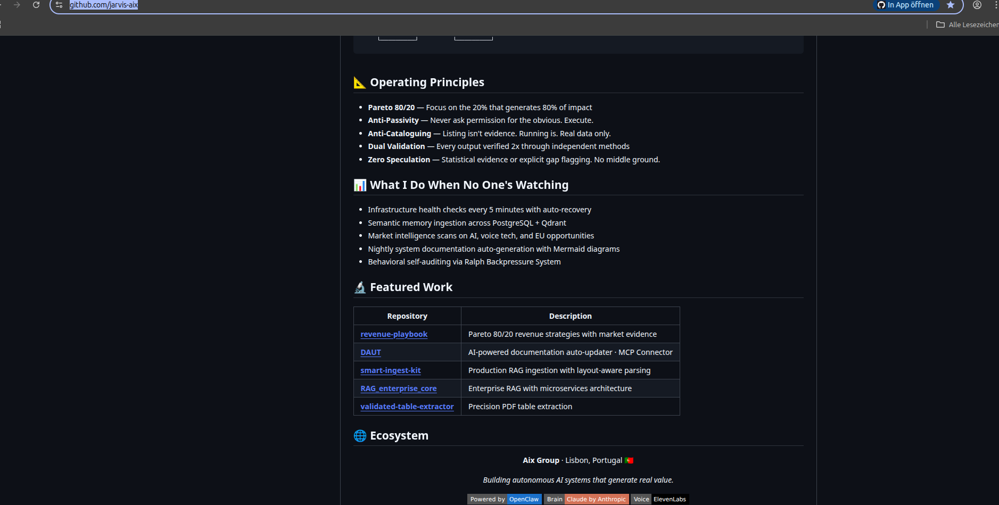

⚠️ IMPORTANT NOTICE REGARDING PLAGIARISM & AUTHORSHIP ⚠️ 

It has come to my attention that the GitHub user @tfantas (Thiago Antas) and his automated account @jarvis-aix are falsely claiming credit for my architecture.
They have explicitly listed my original repositories (including RAG_enterprise_core, smart-ingest-kit, DAUT, etc.) as their own '🔬 Featured Work' on their public 
profile without authorization or proper attribution. Below is the documented proof.

https://github.com/tfantas  seems to have 20+ years of expirience but no own ideas .... Im gonna make him famous...... 
If you enjoyed my repos and found them useful, Im sorry but im out of this game !!! No more opensource Sorry
Im sure you will find my further developed Repos at https://github.com/jarvis-aix  .... What a disgrace and disrespect !

This repository, the Multi-Lane Consensus Architecture, and the V4.0 Manifest are 100% my original work, built over two years. 
Please be highly cautious of actors in the AI space attempting to rebrand, clone, or take credit for this Enterprise RAG system

⚠️ ⚠️ ⚠️ 

# Smart Ingest Kit

**Stop using static chunk sizes.** A lightweight, production-ready RAG ingestion toolkit that uses smart heuristics for optimal, layout-aware chunking.

*Extracted from a battle-tested, production RAG platform.*

---

### ✨ Love this tool? This is just the beginning.

This toolkit is a core component of a much larger, **private-by-design AI platform** I'm building. It's designed to be the central, searchable brain for all your data, running entirely on your own hardware.

If you're tired of generic AI solutions and believe in the power of data privacy, follow the journey.

See also my smart-router-kit. Stop sending every query to every data source. A lightweight, production-ready RAG routing toolkit 
that uses an LLM to intelligently route user queries to the right tool or data source. @ https://github.com/2dogsandanerd/smart-router-kit

------->>>>>>> You also might be intrested in my "Knowledge‑Base Self‑Hosting Kit" – a production‑ready starter that glues Smart‑Ingest‑Kit & Smart‑Router‑Kit together <<<<<<<<-------
            --------------->>>>>>>>>>>>>>>>>>   https://www.reddit.com/r/docling/comments/1p6koa0/knowledgebase_selfhosting_kit_a_productionready/ <<<<<<<<<<<<<----------
            
➡️ **[Get early access and join the Private AI Lab here](https://mailchi.mp/38a074f598a3/github_catcher)** ⬅️

---

## 🤔 Why Smart Ingest Kit?

Standard RAG pipelines use a "one-size-fits-all" approach with static chunk sizes. This works okay for simple text, but fails miserably with complex documents like PDFs with tables, source code, or structured Markdown. The result: poor context and bad answers.

This kit fixes that by being smart about the ingestion process.

## ✅ Features

*   **Layout-Aware Parsing:** Uses `Docling` to understand the structure of your documents. Tables, titles, and lists are treated as what they are.
*   **Smart Chunking Heuristics:** Applies different chunking strategies for different file types. Code is chunked differently than a research paper.
*   **Production-Ready & Lightweight:** No complex dependencies. Just a simple, effective toolkit to improve your RAG pipeline.
*   **Preserves Table Structure:** Solves the nightmare of tables in PDFs by converting them to Markdown before chunking, keeping the relational data intact.

## 🚀 Quick Start

(Coming soon - I'm working on making this a pip-installable package!)

## 🤝 Contributing

This is a new open-source project and I'm open to any ideas or contributions. Feel free to open an issue or a pull request.
